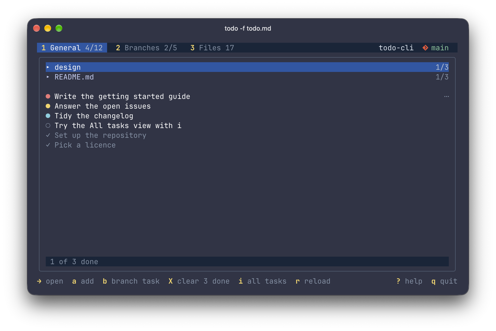
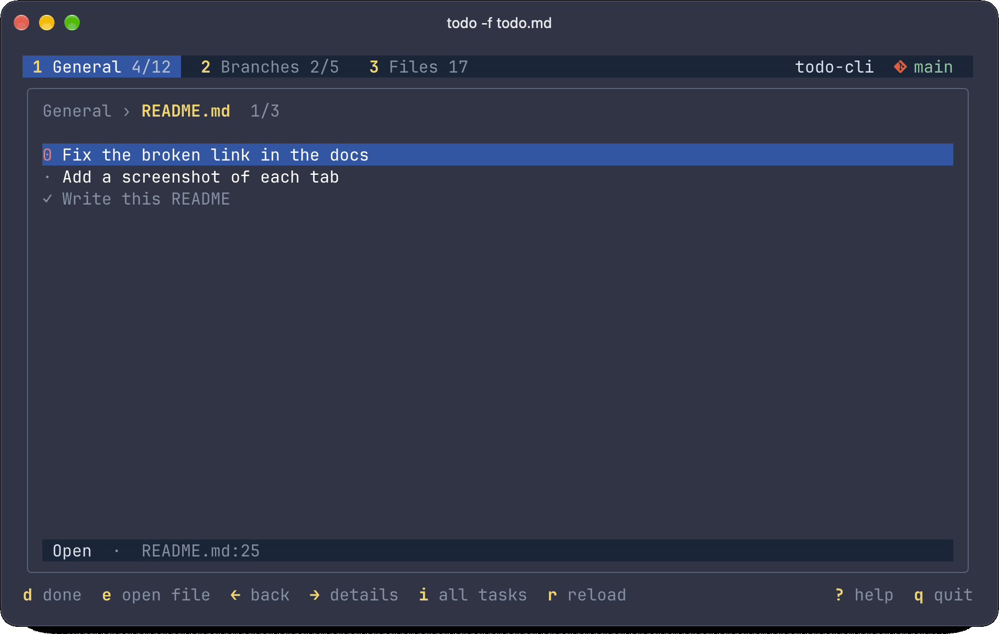
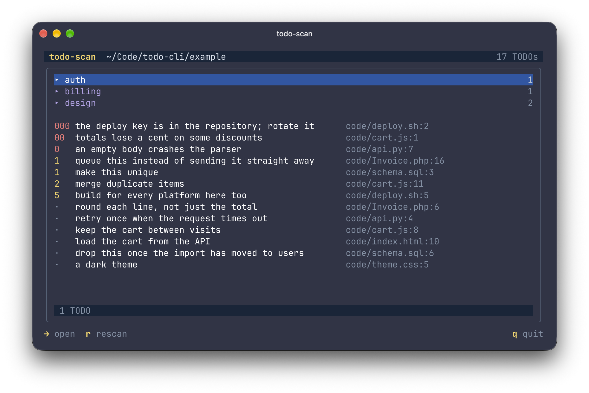

# todo-cli

`todo` keeps tasks in a Markdown file and shows them in a terminal dashboard, alongside the TODO comments in your code and the TODO list in your README. `todo-scan` lists the TODO comments on their own, to browse or to check in CI. Both read [todo-system](https://github.com/archtechx/todo-system)'s categories (`todo@auth`) and levels (`todo0`, `todo1`).



The Git and branch icons need a [Nerd Font](https://www.nerdfonts.com/) in your terminal; without one they show as empty boxes.

## Install

### Download

Each [release](https://github.com/nebarg/todo-cli/releases) has an archive of both commands for macOS and Linux, on `arm64` or `amd64`. For the latest on an Apple silicon Mac:

```sh
curl -sL https://github.com/nebarg/todo-cli/releases/latest/download/todo-cli_darwin_arm64.tar.gz | tar -xz todo todo-scan
```

For an Intel Mac, use `darwin_amd64`, and for Linux, `linux_arm64` or `linux_amd64`.

### Add them to your PATH

To install them for your user only, without `sudo`, move them to `~/.local/bin`:

```sh
mkdir -p ~/.local/bin
mv todo todo-scan ~/.local/bin/
```

If `todo --version` then reports `command not found`, add that directory to your `PATH` in your shell's startup file and open a new terminal:

```sh
echo 'export PATH="$HOME/.local/bin:$PATH"' >> ~/.zshrc   # zsh, the macOS default
echo 'export PATH="$HOME/.local/bin:$PATH"' >> ~/.bashrc  # bash
```

To install them for every user, move them to `/usr/local/bin`, which is on the `PATH` by default on macOS and most Linux distributions:

```sh
sudo mkdir -p /usr/local/bin
sudo mv todo todo-scan /usr/local/bin/
```

### With Go

```sh
go install github.com/nebarg/todo-cli/cmd/todo@latest
go install github.com/nebarg/todo-cli/cmd/todo-scan@latest
```

`go install` puts them in `$(go env GOPATH)/bin`, which is `~/go/bin` by default, or in `$GOBIN` if it's set. Add that directory to your `PATH` as above. From a checkout, `go build ./cmd/todo ./cmd/todo-scan` builds both in the current directory.

### zsh completion

zsh ships a completion for DevTodo, a different program also called `todo`. Pressing Tab after `todo` runs this `todo` with DevTodo's flags, which prints `unknown flag: --format`. To turn that completion off, add this to `~/.zshrc` after `compinit`:

```zsh
compdef -d todo
```

## Try it

[`example`](example) has a task file with a category, priorities and two branches, a README with TODOs, and code with TODO comments:

```sh
cd example
todo -f todo.md
todo-scan code
```

## todo

```
todo [flags]                   open the dashboard
todo [flags] [@category] task  add a task
todo [flags] --clear-done      remove done tasks
todo [flags] --clear-missing   remove tasks of branches no longer in Git
```

```sh
todo                                   # open the dashboard
todo Update the changelog              # add a general task
todo -p high Fix the login redirect    # with a priority
todo @docs Write the install guide     # in the docs category
todo -c docs -p l Proofread the FAQ    # the same with flags, at low priority
todo -b . Fix the flaky test           # on the current Git branch
todo -b feature/login Add 2FA          # on another local branch
todo -f ~/notes/todo.md Renew passport # in another task file
todo -- -v flag is broken              # task text starting with a dash
todo --clear-done                      # remove done tasks
todo --clear-missing                   # remove the tasks of deleted Git branches
todo -e dist -e node_modules           # open the dashboard, skipping these in Files
```

Flags come first; everything after them is the task.

| Flag | Effect |
| --- | --- |
| `-p`, `--priority h\|high\|m\|medium\|l\|low` | Priority of the new task |
| `-c`, `--category name` | Category of the new task. A leading `@name` word does the same; use one or the other |
| `-b`, `--branch name` | Local Git branch of the new task. `.` means the current branch |
| `-f`, `--file path` | Use another task file instead of `todo.md` |
| `-e`, `--exclude dir` | Skip a directory in the dashboard's Files tab. See [Skipping directories](#skipping-directories) |
| `--clear-done` | Remove every done task, and list what went |
| `--clear-missing` | Remove every task, open or done, of branches whose local Git branch no longer exists, with their headings. Git branches aren't changed. Needs Git |
| `--version` | Print the version |
| `-h`, `--help` | Show usage |

- The task file is `todo.md` at the Git repository root, or in the current directory outside Git. It's created when you add the first task.
- A task goes in the general list, a category or a branch. Branch tasks can't have a category. Categories are one word, and `Branches` is reserved. A branch must exist locally.

### Dashboard



- **1 General**: tasks outside branch sections. `▸ category` rows open to show that category's tasks, and `▸ README.md` opens [your README's TODOs](#todos-in-readmemd); uncategorised tasks follow.
- **2 Branches**: every branch with tasks. At startup it opens on the current branch's tasks, if it has any.
- **3 Files**: the [TODO comments](#todo-comments) in files under the working directory. Scanning runs in the background, and these are read only.

Each tab returns to where you left it. Press `1` or `3` again to leave an opened category, and `2` again to switch between the branch list and the current branch. `←` or `esc` goes back one level.

A branch whose local Git branch has been deleted shows as `⚠ branch-name  missing` in red. Its tasks stay visible but read only. Opening a branch re-checks it; `r` re-checks them all. If Git has switched branch since the Branches tab opened the current one, `r` opens the new current branch instead, or the branch list if it has no tasks.

#### Reading the list

- `●` in red, yellow or cyan: high, medium or low priority. `○`: no priority.
- `✓`: done. Done tasks sit at the end of each group.
- `⋯` at the end of a row: the task has details. Press `→` to read them.
- Counts such as `1/2` are done/total, for tabs, categories and branches. Files shows its number of matches, or `…` while scanning.
- The status bar under the list describes the highlighted row, and the footer shows the main keys for it.

Rows keep their place after edits. The list re-sorts when it opens and when you press `r`.

#### All tasks

`i` opens a full-screen list of every Markdown task, with its category (`@auth`) or branch in the last column. `s` cycles between priority, branch and category order, and `i`, `esc` or `←` returns to the dashboard. The task keys work here too, with `enter` opening the edit form.

#### Adding and editing

`a` adds a task where you are:

- in General, a general task, or one in the opened category
- in Branches, to the opened branch, or the current Git branch at the top level
- in Files or All tasks, a general task

`b` adds to the current Git branch from anywhere, or to the opened branch.

In the form:

- `tab` / `shift+tab` move between Task, Category or Branch, and Details.
- `enter` adds a new line in Task or Details, `ctrl+enter` saves, and `esc` cancels.
- The Branch field suggests local Git branches as you type. You can only pick a branch that exists.
- When editing, changing the category or branch moves the task. A heading left empty is removed.

`c` changes just the category of a general task, without the form.

#### Deleting and clearing

`backspace` deletes the selected task with its details.

`X` clears done tasks from where you are: the opened category or branch, the whole tab, or everything in the All tasks view. The tasks of missing branches go too, open ones included. Inside a missing branch, `X` removes all of its tasks.

Both show a dialog naming what will go, including headings left empty, and only `y` goes ahead. Afterwards `u` undoes it, until the file next changes.

#### Keys

| Key | Action |
| --- | --- |
| `1` `2` `3`, `tab` / `shift+tab` | Switch tab |
| `↑` `↓` / `j` `k` | Move |
| `→` | Open a category or branch, or a task's details |
| `←` / `esc` | Back |
| `i` | All tasks (`s` to change the sort) |
| `a` / `b` | Add a task / add a branch task |
| `e` / `enter` | Edit a task, or open a file or README TODO in your editor. `enter` also opens a category or branch |
| `d` / `space` | Mark done or reopen |
| `p` / `c` | Cycle priority / change category |
| `backspace` | Delete a task |
| `X` / `u` | Clear done / undo the clear or delete |
| `r` | Reload the file and Git branches, and rescan files |
| `?` | Help |
| `q` / `ctrl+c` | Quit |

File and README TODOs open in `$VISUAL`, then `$EDITOR`, falling back to `vi`. Vim, Neovim, VS Code, Codium and Cursor open at the TODO's line. When the editor exits, the tasks reload and the Files tab rescans.

### Markdown format

```md
- [ ] Generic task

# tests

- [ ] Test login failures !high

  When a session expires, signing in again returns to the wrong page.
  Expected: return to the page the user was viewing.

# Branches

## feature/login

- [ ] Fix the flaky login test
```

- **Sections:** tasks before the first heading are general. `## branch-name` headings under `# Branches` are branch sections, and headings nested inside a branch stay part of it. Any other heading is a category.
- **Categories** can't contain spaces, and `Branches` is reserved. `auth`, `@auth` and `#auth` all mean the same category.
- **Details** are everything under a task until the next task or heading: paragraphs, lists, code, even indented checkboxes. The app writes them indented by two spaces.
- **Priority** is a trailing `!high`, `!medium` or `!low`. Only a last word that names a priority counts, so `Ship it!` and `Fix !important CSS` stay as they are.
- **Plain list items** such as `- Buy milk` are read as tasks, and become `- [ ] Buy milk` when edited.

When the app writes a task, it re-sorts that task's section: open tasks by priority (high, medium, low, none), then done tasks.

- Tasks move with their details, and tasks of equal priority keep your order.
- Notes above the first task and nested headings stay put, as do other sections.
- A compact list without blank lines stays compact.
- All other Markdown is preserved.

### TODOs in README.md

The dashboard reads the TODO list in the `README.md` next to the task file, following todo-system's rules for READMEs. The tasks are listed under `▸ README.md` in General and aren't copied into `todo.md`.

```md
## TODOs

- Write the install guide
- [ ] todo0 Fix the broken example
```

- Tasks are the list items (`- foo` or `- [ ] foo`) directly under a heading reading `TODO` or `TODOs`, with or without a `:`, in any case. The next heading ends the list.
- Nested list items are tasks too, and anything in a ` ``` ` code block is skipped.
- `d` marks a task done or reopens it. It changes only the checkbox, adding one to a plain `- foo`, and leaves the README's order alone.
- Levels such as `todo0` show and sort as in the Files tab. `p`, `c`, `backspace`, `X` and the edit form don't apply; `e` opens the README in your editor at the task.

## todo-scan



`todo-scan` is the dashboard's Files tab on its own, for any directory. It doesn't read or create a task file.

```sh
todo-scan                       # browse the TODOs under the current directory
todo-scan ~/Code/api            # under another directory
todo-scan -e dist -e vendor     # skipping these directories
todo-scan --list                # print them as path:line: text, most urgent first
todo-scan --check               # print how many there are, and exit 1 if any
todo-scan --list --check        # the list on stdout, the count on stderr
todo-scan --levels --list       # only levelled TODOs, todo0 to todo9
todo-scan --level 0+ --check    # only todo0, todo00 and so on, and exit 1 if any
todo-scan --level 0,1 --list    # only todo0 and todo1
```

| Flag | Effect |
| --- | --- |
| `--list` | Print every TODO as `path:line: text`, most urgent first |
| `--check` | Print how many TODOs there are, such as `3 TODOs`, and exit 1 if there are any. With `--list`, the count goes to stderr |
| `--levels` | Only levelled TODOs, `todo0` to `todo9` |
| `--level level` | Only TODOs at this level: `0` matches `todo0`, `00` matches `todo00`, and `0+` any number of zeros. Repeat it, or separate levels with commas |
| `-e`, `--exclude dir` | Skip a directory. See [Skipping directories](#skipping-directories) |
| `--version` | Print the version |
| `-h`, `--help` | Show usage |

- The directory defaults to the current one. Without `--list` or `--check`, it opens the browser, with the Files tab's keys plus `r` to rescan and `q` to quit.
- `--levels` and `--level` apply to the browser too.
- Given a directory, `--list` starts each path with it in its shortest form: `todo-scan --list ../api` prints paths such as `../api/main.go`, and `todo-scan --list ./api/` paths such as `api/main.go`.
- Exit status: 1 when `--check` finds TODOs, 2 for errors such as a missing directory or an unknown flag, and 0 otherwise.

A CI step that fails while any levelled TODOs remain:

```yaml
- name: No levelled TODOs
  run: todo-scan --list --check --levels
```

## TODO comments

The Files tab and `todo-scan` list case-insensitive `TODO` and `@todo` comments with their file and line. A marker counts when it starts the comment, as in `// TODO fix`, or is followed by `:` or `(` anywhere in it, so `* @return todo` doesn't match. In commented-out code, a comment after the code counts as starting there, as in `// x = 1; // TODO drop x`. `@ todo` is read as `@todo`. [todo-system markers](#todo-system-syntax) count anywhere in a comment.

Both show the comment text first and a shortened path beside it. The status bar shows the full path of the highlighted TODO. `→` opens a detail page with the TODO's text and as much of the surrounding code as fits, and `e` opens the file in your editor.

- Only comments count. Each file is read with the comment syntax for its extension, so code and strings such as `class Todo {`, `"TODO"`, CSS's `#todo` and C's `#define TODO` don't match. Comments spanning several lines are followed to their end.
- A file with PHP in it is read as PHP whatever its extension, and HTML and template files also count `//` and `/* */` comments in their scripts and styles. Files of an unknown type are read a line at a time, guessing where each line's comment starts.
- Gitignored, binary and Markdown files, files over 1 MB, and directories starting with `.` are skipped. Hidden files, such as `.eslintrc.js`, are read.

### Skipping directories

`node_modules` and `vendor` are skipped by default. To skip others, give `-e` / `--exclude` once per directory, to `todo` or `todo-scan`:

```sh
todo -e node_modules -e vendor -e dist
todo-scan -e ./web/generated
```

- A bare name, such as `dist`, skips every directory with that name.
- Anything with a slash, such as `./web/generated`, is a path from the working directory.
- Giving `-e` replaces the defaults, so list `node_modules` and `vendor` again if you still want them skipped.

### todo-system syntax

[todo-system](https://github.com/archtechx/todo-system)'s markers count anywhere in a comment:

| Marker | Meaning |
| --- | --- |
| `todo@boundary Split this` | Category: listed under a `▸ boundary` row |
| `todo000`, `todo00`, `todo0` | Priority levels: the more zeros, the more urgent |
| `todo1` … `todo9` | Lower priority levels, in order |
| `TODO: fix`, `todo refactor` | Generic |

- Category rows open like categories in General, and `3` again goes back.
- Levels are listed first, most urgent at the top, with the level beside the text. Zero levels are red, and other levels yellow.
- Four or more zeros are labelled `0x4` to `0x9`, then `0x9+`. They sort by the real count.
- As in todo-system, a TODO has a category or a level, not both: `todo1@boundary` is just in `boundary`.
- Levels todo-system doesn't accept, such as `todo11`, have no level. They count as generic TODOs where a plain `TODO` would: at the start of a comment, or before `:` or `(`.

## Development

```sh
go run ./cmd/todo
go test ./...
go tool -modfile=tools/go.mod golangci-lint run ./...
go tool -modfile=tools/go.mod govulncheck ./...
```

The linter and govulncheck versions are pinned in their own module, `tools/go.mod`, and the linter is configured in `.golangci.yml`.

CI runs the tests on Linux and macOS, the linter and govulncheck on every push to `main` and every pull request.

### Releasing

Pushing a tag such as `v0.1.0` runs the release workflow. It tests, then [GoReleaser](https://goreleaser.com) builds the archives for macOS and Linux, configured in `.goreleaser.yaml`, and publishes them with a checksum file as a GitHub release. `--version` prints the tag.
